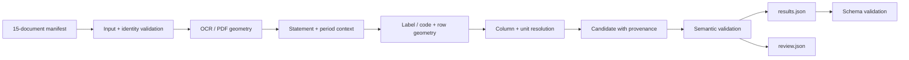

# Takeovers Bilan Challenge

A deterministic, provenance-first Python pipeline for extracting financial facts from French annual filings.

The implementation deliberately optimizes for **correctness, traceability and honest abstention** rather than maximum field coverage. It uses the OCR shipped by Takeovers and keeps every accepted value grounded to the original PDF page and normalized bounding box.

## Demo video

[](https://youtu.be/4alN0ZTs76A)

▶️ [Watch the ~3 minute solution walkthrough on YouTube](https://youtu.be/4alN0ZTs76A)

## 1. Problem

The Bilan challenge asks for 12 financial fields across 15 filings, together with the page and bounding box where each value was read. The documents are real filings: layouts vary, OCR is imperfect, some pages are rotated, units can change by table, and the same row can contain gross, depreciation, current-period net and comparative values.

The core engineering problem is therefore not numeric parsing alone. For every emitted value the pipeline must establish:

**company → fiscal period → accounting concept → correct column → number → unit → source location**.

If that chain is not defensible, the field is omitted and the reason is recorded in `review.json`.

## 2. Deliberate scope

The MVP implements six well-defined P0 fields:

- `BS_TOTAL_ASSETS_FRGAAP`
- `BS_TOTAL_EQUITY_FRGAAP`
- `PL_REVENUE_FRGAAP`
- `PL_EXT_SERVICES_COSTS_FRGAAP`
- `PL_FINANCIAL_RESULTS_FRGAAP`
- `PL_INCOME_TAX_FRGAAP`

Two fields are left as P1 (`PL_PERSONNEL_COSTS_FRGAAP`, `META_AVG_WORKFORCE_FRGAAP`). Four catalogue definitions are intentionally deferred because the supplied labels/notes leave a material semantic choice unresolved: COGS, depreciation/provisions, capital/reserves and cash/VMP.

This follows the challenge's stated preference for fewer reliable fields over silent incorrect values.

## 3. Architecture



The pipeline is one local Python command. There is no database, service layer, OCR engine, model server or cloud dependency.

### Main modules

- `inputs.py` — exact 15-document manifest, metadata/OCR/PDF joins, page geometry and input integrity.
- `geometry.py` — OCR polygon envelopes and 300-dpi → normalized `[0,1]` bounding boxes.
- `extract.py` — conservative number parsing, statement/period detection, scoped unit evidence, field rules and candidate selection.
- `checks.py` — semantic output validation, balance-sheet reconciliation and reviewed-sample evaluation.
- `__main__.py` — CLI orchestration, timing, serialization and diagnostics.

## 4. Extraction strategy

I use the supplied **flat OCR as the canonical text stream**, with layout/table output only as supporting geometry. During repository inspection I found cases where layout text and flat OCR disagree at the same polygon, so blindly concatenating both would duplicate or contradict evidence.

The extractor prefers, in order:

1. a standard accounting code plus a matching field label;
2. an explicit field label inside the correct statement context;
3. a clearly equivalent primary statement in the same filing;
4. otherwise, abstention.

### Why not an LLM in the runtime pipeline?

Most MVP operations are deterministic: identifying standard row codes, parsing numbers, choosing accounting columns, resolving units, converting coordinates and validating identities. A model would add cost and nondeterminism without removing the need for source grounding. A targeted model fallback would only be justified after measuring a specific failure category against this baseline.

## 5. Current period and column selection

A major failure mode is selecting the correct row but the wrong numeric column.

For example, a 2050 asset row can contain:

`gross | depreciation/provisions | net N | net N-1`

The pipeline therefore does not use a single fixed x-coordinate. It uses explicit fiscal-period headers and, for assets, the `Net` column header. This was added after a regression case where a geometric prior selected accumulated depreciation instead of net total assets.

That case is permanently covered by `tests/test_regression.py`.

## 6. Units

Units are treated as **scoped evidence**, not as a company-level attribute.

The resolver prefers the most local applicable cue and distinguishes `EUR`, `kEUR` and `count`. This matters because one filing can contain main company accounts in EUR while a subsidiary table on another page is explicitly in kEUR.

When no contrary scale cue exists, the standard French-form EUR basis is used and disclosed in `review.json`. Numeric magnitude is never used to guess the unit.

## 7. Provenance

Every accepted output value contains:

- physical PDF page, 1-indexed;
- normalized bounding box `[x0, y0, x1, y1]`;
- the exact OCR snippet used.

The shipped OCR uses pixels at 300 dpi. Normalization follows the supplied viewer convention:

```text
x_norm = x_ocr_px / (page_width_points * 300 / 72)
y_norm = y_ocr_px / (page_height_points * 300 / 72)
```

Original OCR polygons are preserved internally. Working-coordinate decisions never replace the coordinates of the evidence itself.

The supplied `tools/bbox_viewer.py` can be used to visually verify any emitted box.

## 8. Validation and failure visibility

Validation is intentionally separate from extraction.

Hard output checks include:

- official JSON Schema validation;
- field-key allowlist and uniqueness;
- valid page ranges;
- ordered normalized bounding boxes;
- monetary/count unit compatibility.

Additional checks include total assets versus independently read full passif where the required source is available.

`review.json` records omissions and diagnostic evidence separately from the scorer-facing `results.json`. Missing evidence is not converted to zero, and conflicting sources are not resolved by first-match-wins.

## 9. Evaluation

There is no official answer key, so I do not claim global accuracy.

I created a disclosed source-grounded sample of **30 field/document opportunities** across five filings. The reference values, units, pages and source snippets were checked against the supplied filing evidence before being used as regression references.

On the final measured run:

- reviewed opportunities: **30**
- exact value + unit agreement: **30 / 30**
- grounded agreement (value + unit + page + source snippet): **30 / 30**
- missed available fields in this reviewed sample: **0**

This is explicitly **sample agreement, not a 100% global-accuracy claim**. The reference set is in `tests/fixtures/reviewed.json` and the measured evaluation is written to `review.json`.

## 10. Measured run

Final local run over the complete allowlist:

- documents attempted: **15 / 15**
- physical pages inspected: **415**
- accepted P0 values: **57**
- extraction API/model calls: **0**
- incremental extraction API cost: **€0.00/page**
- measured end-to-end time before final serialization bookkeeping: **25.50 s**
- measured time per physical page: **0.0615 s/page**

Accepted coverage by field:

| Field | Accepted documents |
|---|---:|
| Total assets | 14 / 15 |
| Total equity | 12 / 15 |
| Net revenue | 7 / 15 |
| External services | 8 / 15 |
| Net financial result | 7 / 15 |
| Income tax | 9 / 15 |

The timing denominator includes all 415 physical pages, including empty OCR pages. The €0/page statement means **no incremental API calls in this extractor**; it does not price Takeovers' upstream OCR, local compute or human review.

## 11. Reproduce

Python 3.11+ is required. The final run used Python 3.12.

The challenge corpus is intentionally not copied into this candidate repository. Place/clone the official Takeovers challenge repository locally and point `--data-root` to its `data/` directory. This workspace used the upstream challenge repository pinned during planning at commit `a705bcc86614c8552cc4270c762a6a6399c751ba`.

```bash
python -m venv .venv
# activate the environment
python -m pip install -e ".[dev]"

python -m bilan --data-root challenge-reference/data inventory
python -m bilan --data-root challenge-reference/data run
python -m bilan validate results.json
python -m pytest
```

Useful output files:

- `results.json` — scorer-facing challenge artifact.
- `review.json` — diagnostics, evaluation, timing, omitted-field reasons and source evidence.

To inspect a box visually:

```bash
python tools/bbox_viewer.py \
  --pdf <pdf> \
  --page <page> \
  --ocr <ocr-directory> \
  --bbox x0,y0,x1,y1 \
  -o check.png
```

## 12. Trade-offs and limitations

- **Coverage vs correctness:** six fields were prioritized over speculative implementations of all twelve.
- **Provided OCR vs new OCR:** reusing the supplied OCR keeps the challenge focused on structuring and grounding data; OCR errors remain possible and are visible in source snippets.
- **Rules vs model calls:** deterministic rules are cheap, reproducible and auditable, but do not recover every non-standard narrative/table layout.
- **Abstention:** some filings genuinely lack the relevant statement; others contain a statement but no candidate that passes the current rule set.
- **Evaluation:** the 30-item sample supports a limited, inspectable claim only. A production system needs a much larger adjudicated corpus.
- **Comparatives:** accounting identities are used as validation evidence, not as a way to repair source values.

## 13. What I would do with more time

1. Resolve the four field-definition conflicts before enabling them.
2. Add personnel cost as the first derived field, preserving both operand sources.
3. Expand the independently reviewed evaluation corpus and classify failure modes by layout/OCR/unit/definition.
4. Compare a targeted vision/model fallback only on the diagnosed hard subset, with measured latency, token cost and grounded correctness.
5. Add versioned extraction-rule monitoring for a production setting.

## 14. How I used AI

AI tools were used extensively for repository inspection, architecture planning, implementation assistance, debugging and documentation. I did **not** use model output as financial evidence and the runtime extraction path makes no LLM/VLM calls. Important rules were checked against the supplied challenge schemas and filing evidence, and observed failures were converted into regression tests rather than patched with expected answers in production code.

Examples of AI-assisted work include identifying candidate failure modes, proposing module boundaries and helping debug OCR/layout edge cases. Verification remained source-driven: the final output must still pass the deterministic test suite, official schema validation, semantic checks and the disclosed reviewed reference sample.

## Supporting design notes

The repository also includes the working engineering notes used to keep scope and decisions explicit:

- `docs/TECHNICAL_PLAN.md`
- `docs/FIELD_MATRIX.md`
- `docs/IMPLEMENTATION_BACKLOG.md`

They are supporting material; this README is the intended submission narrative.
