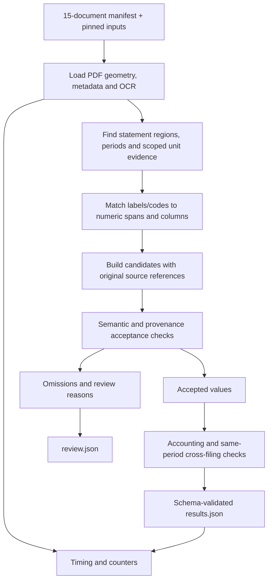

# BILAN: technical planning package

**Status:** repository audit and design only. No extraction pipeline, production tests, `results.json`, accuracy score or runtime benchmark has been produced. Estimates below are planning budgets, not measurements.

**Recommendation:** one local Python command using the provided OCR, explicit field definitions and geometric evidence. Process the 15 scoped filings, target six well-defined fields first, report omissions, and prove that accepted numbers point to the correct text. Keep model calls out of the MVP.

This is one of three planning documents:

- This document: audit, architecture, contracts, evaluation, priorities and decisions.
- [FIELD_MATRIX.md](FIELD_MATRIX.md): all 12 exact identifiers, extraction rules and unresolved definitions.
- [IMPLEMENTATION_BACKLOG.md](IMPLEMENTATION_BACKLOG.md): ordered tasks, milestones, acceptance criteria and interview preparation.

All prose intended for the eventual submission is in English. These are working planning documents; the final README should be a concise engineering narrative, not a copy of the whole package.

## A. Repository audit

### What was actually inspected

The initial workspace contained only `takeovers-challenge.pdf`, `takeovers-bilan.pdf` and `takeovers-actes.pdf`; it was not a Git repository. All three briefs were text-extracted and read. Their official repository link was followed, and the repository was cloned to `challenge-reference/` without changing the supplied files.

Source: [Takeovers engineering challenges](https://github.com/takeovers-ai/engineering-challenges), commit **`a705bcc86614c8552cc4270c762a6a6399c751ba`**, commit date 2026-09-10. The local clone is clean, has the upstream remote and one shallow-history commit. No candidate branch, commit, remote submission or PR was created.

Audit coverage:

- Inventoried the entire tracked tree and all 20 company directories.
- Parsed all 4,286 JSON files: 3,995 OCR pages, 287 metadata records and four schemas/catalogues. No JSON parse errors were found.
- Read the root README, NOTICE, Git configuration files, Bilan brief, both Bilan schemas and the complete viewer implementation; inspected the other tracks to establish their boundaries.
- Inspected metadata and all OCR page structures/text indexes for the 15 target filings; checked page counts and geometry against each PDF.
- Visually reviewed representative financial pages across all five companies, unit notes, two blank-page examples, a rotated PDF and a rotated two-statement page. Ran the supplied bbox viewer on both rotation cases.
- **This is not a manual transcription of all 415 pages or a content review of all out-of-scope legal filings.** Structural audit is exhaustive; visual and semantic audit is representative.

### Actual repository structure and dependencies

| Provided item | Finding / consequence |
|---|---|
| Root | README, NOTICE, `.gitignore`, `.gitattributes`, `challenges/`, `data/`, `tools/`; no root `schema/` |
| Bilan contract | `challenges/bilan/schema/financial_fields.json` and `results.schema.json` |
| Shared corpus | 20 SIRENs; 110 bilan PDFs and 177 acte PDFs, with one metadata JSON per PDF |
| OCR | 2,178 bilan page JSONs and 1,817 acte page JSONs; wider coverage is uneven |
| Existing code | Only `tools/bbox_viewer.py`; no extractor, test suite, dependency lock, packaging or CI configuration |
| Viewer dependencies | PyMuPDF and Pillow; no OCR engine or cloud service required |
| Ignore rules | Only `.DS_Store`, `__pycache__/`, `*.pyc`; a future submission must add `.env`, local data/reference clone and generated scratch files |
| Attributes | PDFs marked binary; no LFS configuration found |
| Instructions | No `AGENTS.md` found in the supplied repository |
| NOTICE | Some image PDFs were reduced to 150 dpi while retaining page geometry. OCR remains at 300 dpi. Corpus is for the hiring exercise; do not re-publish it in the candidate repository |

The NOTICE and the output schema contain old illustrative data paths. Actual data lives at `data/<siren>/bilans/{pdf,meta,ocr}`. Use the filesystem and the Bilan brief's exact allowlist, not those stale examples. The attached PDFs additionally require a roughly three-minute video; keep that requirement even though the current Markdown brief omits it.

### Exact scope inventory

File convention: `data/<siren>/bilans/pdf/bilan_<deposit_date>_<doc_id>.pdf`. OCR directory: `data/<siren>/bilans/ocr/<doc_id>/page_NNN.json`. Metadata filenames are joined by the document ID; metadata `nomDocument` and OCR `pdf` retain original registry names and are not local filenames.

| SIREN | Deposit date | Document ID | Metadata fiscal close | PDF / OCR pages |
|---|---|---|---|---|
| 820561470 | 2023-06-05 | 6493e4372f502414800f8164 | 2021-08-31 | 17 / 17 |
| 820561470 | 2023-06-13 | 6543d3fd08093cdace058668 | 2022-08-31 | 15 / 15 |
| 820561470 | 2024-01-15 | 67458f18cea78a70070fa226 | 2023-08-31 | 13 / 13 |
| 328024377 | 2020-12-24 | 63e8ebbb54febda17c19ee7c | 2020-06-30 | 29 / 29 |
| 328024377 | 2021-12-17 | 63e8ebbb54febda17c19ee7d | 2021-06-30 | 43 / 43 |
| 328024377 | 2022-12-13 | 63e8ebbb54febda17c19ee7e | 2022-06-30 | 42 / 42 |
| 445070311 | 2022-02-14 | 63e2481c916269756a09542b | 2020-06-30 | 28 / 28 |
| 445070311 | 2023-11-21 | 65a4095d5fd178b16b09b860 | 2022-06-30 | 58 / 58 |
| 445070311 | 2025-05-15 | 6860f28ca0138eae340c7453 | 2023-06-30 | 32 / 32 |
| 504304205 | 2017-05-31 | 63e13943526e1f30cd100db5 | 2016-12-31 | 28 / 28 |
| 504304205 | 2018-10-24 | 63e13943526e1f30cd100db6 | 2017-12-31 | 30 / 30 |
| 504304205 | 2024-08-06 | 66cd893cedec9b09d50191e8 | 2020-12-31 | 33 / 33 |
| 401009741 | 2022-11-30 | 63e881158be6eb9f9d1ff975 | 2022-04-30 | 16 / 16 |
| 401009741 | 2023-11-20 | 65784e5da67d84faf4042736 | 2023-04-30 | 16 / 16 |
| 401009741 | 2025-10-03 | 68f0a715f28d8aaf48046416 | 2025-04-30 | 15 / 15 |
| **Total** | | | | **415 / 415** |

Do not infer chronological adjacency from deposits. SO.ME.PROD's 2024 deposit reports 2020. CREAMANDE's 2025 comparative period cannot automatically be compared with its 2023 filing. Every document has an OCR file for every page, but that does not mean every file contains text.

### Real OCR and layout structures

Base page keys: `layout`, `most_frequent_angle`, `ocr`, `page`, `pdf`, `skew_angle`. Some pages add `_reocr_corrected_count`, `_reocr_failed_count`, `_reocr_failures`; preserve these as input diagnostics without inventing undocumented semantics.

- Flat `ocr[]`: `orientation_angle`, four-point `polygon`, `score`, `text`.
- Non-table layout element: `bbox`, `label`, `score`, `texts[]`.
- Table layout element: `bbox`, `label`, `score`, `cells[]`.
- Cells contain `bbox`, `score`, `texts[]`; **there are no guaranteed row/column indices or reconstructed numeric matrices**. Empty and overlapping cells occur.
- Text occurs in both flat OCR and layout. These are not independent observations to concatenate or count twice.

Scope measurements: **28,470 OCR lines, 294 table-labelled regions, 46 pages with empty layout, 41 with empty OCR, 102 pages with extra re-OCR keys**. At identical polygons, **131 layout text occurrences disagree with flat OCR text**. Example: BERNACHON 2021 p4 contains layout `096` versus flat OCR `960`. Count is per occurrence, not unique semantic field.

Use flat OCR as the canonical textual stream because it is the intended flat output and exposes these differing readings. Reuse layout boundaries as supporting geometry; preserve disagreements for review. Neither stream is guaranteed correct. The brief's approximate table counts must not be treated as a verified count of `label == table` in this checkout.

### Findings that change the design

1. **Mixed units, not a company-level currency flag.** BERNACHON 2021 p6 says amounts are in euros unless stated; p11 labels the subsidiaries table in kilo-euros. Its balance sheet p2 contains net total 4,823,303, while the notes report 4,823,304 euros. The kEUR table is about investees and cannot set the parent's balance-sheet unit. The one-euro discrepancy is a warning, not permission to alter the statement.
2. **Confidentiality affects achievable coverage.** All three PAUTET metadata records are partially confidential; full P&L statements were not found in the inspected text/page inventory. CREAMANDE 2025 lacks the usual 2052/2053 pages. SO.ME.PROD 2020 has no standard 2052/2053 sequence, though notes give some figures. Treat missing target lines as unavailable unless supported elsewhere; never reconstruct hidden accounts from unrelated totals.
3. **Blank OCR can be expected input.** BOCKEL 2022 has 26 empty OCR pages; BOCKEL 2023 has 15. Sampled even-numbered pages are visually blank. Do not claim all 41 are blank without reviewing them; distinguish empty OCR from confirmed blank images.
4. **Physical page and statement are different units.** BOCKEL 2023 p9 contains rotated actif and passif statements on the same page. Identify multiple regions; never use the first `TOTAL GENERAL` match globally.
5. **Rotation has two forms.** CREAMANDE 2025 has PDF `/Rotate = 270` across all 15 pages, but OCR matches the upright displayed `page.rect`. BOCKEL p9 has zero PDF rotation yet sideways scan content. `orientation_angle = 1` is not one degree; treat it as undocumented categorical metadata, corroborated by polygons/images.
6. **Net versus gross is a primary risk.** The total-assets row often includes both values, plus deductions and occasionally N-1. A code match alone is insufficient.
7. **N-1 is not universally available on every form.** Some 2050 and 2052 versions in this corpus show only N. Other accountant statements have comparisons; duplicate financial presentations are common in BERNACHON.
8. **Four definitions need adjudication.** COGS sign convention, capital/reserves, cash/VMP and depreciation/provisions are unresolved in the catalogue. Their details and safe defaults are in the matrix.

## B. Problem decomposition

Each accepted output answers six questions: **which company, which exercise, which accounting concept, which printed number, which reporting unit, and where is the evidence?** Extraction succeeds only when all six are supported.

Break the work into input integrity; statement/period context; label and numeric association; scale/sign interpretation; provenance; acceptance checks; and evaluation. Missing or ambiguous evidence is an explicit outcome at each step. Cross-document checks run after extraction so they cannot manufacture source values.

## C. Recommended architecture



Unit evidence and period context are discovered before final value acceptance. Statement-region detection allows multiple statements per PDF page. No separate service, model server, database or workflow framework is needed.

### Components and contracts

| Component | Responsibility / input → output | Strategy and reason | Failure / meaningful test | Interview explanation |
|---|---|---|---|---|
| Manifest and loader | Pinned paths + 15 IDs → Document/Page/OCR records | Verify ID/SIREN/meta/PDF/OCR joins, actual page numbers and page geometry; preserve original strings | Missing file, duplicate page, empty OCR; test wrong ID and page mismatch | “I make the input boundary explicit before extracting anything.” |
| Geometry | Original polygons + displayed PDF dimensions → normalized boxes and working coordinates | Reuse the viewer's normalization convention; preserve originals; rotation only for matching | Double rotation, grossly oversized box; test real rotated PDF and two-up page | “I can transform layout for matching without losing the location on the original page.” |
| Context discovery | Lines/layout/metadata → statement regions, periods, unit evidence | Heading/code clusters and column headers; labels work without form numbers; metadata close is cross-checked | Notes mistaken for statements, subsidiary table; negative-region fixture | “The same label means different things in different contexts.” |
| Candidate extraction | Region + field spec → zero/one/multiple candidates | Flat OCR text, exact aliases/codes, column/row geometry, optional supporting cells; bounded label fuzziness only if justified | Wrong row, gross instead of net, N-1; multi-column regression | “A candidate needs a concept and a column, not just a nearby number.” |
| Derivation, P1 | Accepted component candidates → candidate + formula + all sources | Simple decimal arithmetic for personnel first | Missing component or double counting; reject partial sums | “Derived values have a chain of evidence, not an invented source line.” |
| Acceptance/checks | Candidates → accepted, missing, rejected; independent consistency findings | Structural/semantic gates and explicit diagnostics | Null with fictional bbox, repeated field, conflicting candidates; contract tests | “Abstention is part of the output contract.” |
| Runner/export | Documents + checks + timers → results/review artifacts | Sequential run, standard library timers, authoritative JSON Schema validation, write only after validation | Partial file, invalid metrics; integration test | “The run is one reproducible command and the output validates before it is written.” |

### Approach comparison

These are qualitative expectations to test, not measured accuracy rankings.

| Approach | Expected accuracy / robustness | Complexity | API cost / latency | Explainability / reproducibility | Main risk |
|---|---|---|---|---|---|
| A. Flat OCR + regex only | Good for isolated numbers, poor for dense columns | Low | Zero incremental API / low local latency | High | Wrong field or period despite correct numeric parsing |
| B. OCR + labels/codes + geometry | Promising for well-defined fields across forms | Moderate | Zero incremental API / low local latency | High, deterministic with fixed inputs | Skew, merged spans, missing labels |
| C. Table structure first | Helpful when cells agree with rows/columns | Moderate-high | Zero incremental API / local latency | High | Cells are incomplete, overlapping and sometimes textually stale |
| D. LLM/VLM extraction | May resolve difficult reading; not reliably correct by itself | High once grounding/retries/costs are included | Paid calls and network latency if enabled | Weaker reproducibility | Hallucinated values, boxes, units or formulas |
| E. B with C as supporting evidence | Best fit for the supplied data and time box | Moderate | Same local cost profile | High | Rules can still overfit layouts |

**Primary: E.** Flat OCR + field-specific label/code rules + spatial column selection, with optional cell containment. Prefer standard-library Unicode normalization and small alias lists over a fuzzy-matching dependency. Numeric text is never fuzzily “corrected” to satisfy a check.

**Fallback:** same-document alternative statement or explicit narrative; otherwise abstain and inspect with the provided viewer. A human-reviewed unit scope may be recorded with evidence and disclosed, but do not bake expected financial answers into rules. LLM/VLM fallback is a future experiment, disabled and unimplemented in the MVP. Start with a diagnosed unreadable crop, require real source references, log every call/retry and accept only independently verifiable evidence.

## D. Repository structure

Create the candidate repository at the current workspace root in the implementation phase. Keep the audit clone ignored and read-only; do not publish its corpus. Vendor the two Bilan schemas into `schema/` and the supplied viewer into `tools/` unchanged, retaining attribution and upstream commit. Record that the schemas originated in `challenges/bilan/schema/`.

```text
README.md
pyproject.toml
requirements.lock
.gitignore
.env.example
scope.json
schema/financial_fields.json
schema/results.schema.json
tools/bbox_viewer.py
src/bilan/
    __init__.py
    __main__.py
    models.py
    inputs.py
    geometry.py
    extract.py
    checks.py
tests/
    test_geometry.py
    test_extract.py
    test_contract.py
    test_regression.py
    fixtures/reviewed.json
docs/                       # these three working plans
results.json                # generated at repository root
review.json                 # generated diagnostics/evaluation details
challenge-reference/        # ignored, local upstream clone
tmp/                        # ignored, local audit/rendering scratch
```

`requirements.lock` is a resolved exact-version dependency list, not a second hand-maintained dependency specification. Use Python 3.11+; verify and record the actual interpreter version used. Runtime: PyMuPDF and jsonschema; Pillow for the supplied viewer; pytest as a development dependency. No Pydantic, pandas, OCR engine or model SDK is necessary.

| File/module | Belongs inside | Must not contain | Dependencies |
|---|---|---|---|
| `models.py` | Small dataclasses for source, candidate, accepted field and issue; explicit unit/status types | I/O, accounting rules, fake confidence probabilities | Standard library |
| `inputs.py` | Manifest/path resolution, metadata/OCR loading, PDF dimensions and identity checks | Label matching, arbitrary scanning of all 20 companies | models, PyMuPDF |
| `geometry.py` | Polygon envelope, normalization, working-coordinate transforms, containment and row distances | Monetary parsing, modifying PDFs, silently clipping bad boxes | models or plain numeric inputs |
| `extract.py` | Field specs/aliases, number parsing, scoped units, region/period discovery, direct and small derived extractors | File writing, API clients, unrelated fiscal calculations | models, geometry |
| `checks.py` | Candidate acceptance, result schema validation, accounting comparisons and cross-filing checks | Repairing source values, guessing units from identities | models, jsonschema |
| `__main__.py` | argparse, sequential orchestration, timers/counters, final serialization | Hidden extraction rules or company-specific expected numbers | inputs, extract, checks |
| `__init__.py` | Package marker; deliberately minimal | I/O, configuration loading or side effects | None |
| `pyproject.toml` / `requirements.lock` | Package metadata, declared dependencies and resolved exact versions | Business rules or two independently maintained dependency lists | Chosen Python runtime |
| `.gitignore` | Exclude secrets, reference corpus, environments and scratch outputs; explicitly retain final result artifacts | Rules that accidentally exclude deliverables | Repository layout |
| `scope.json` | Exact 15 PDF identities/paths, upstream commit | Gold financial values or inferred units | Bilan brief |
| `schema/*` | Unchanged supplied contracts | Edits that weaken the evaluator's contract | Upstream |
| `tools/bbox_viewer.py` | Unchanged source-grounding viewer | A new dashboard or extraction logic | Upstream, PyMuPDF, Pillow |
| Tests / fixtures | Meaningful invariants, tiny synthetic cases and reviewed source references | A copied corpus or hard-coded answers used by production | Public module interfaces |
| `review.json` | Rejected/missing reasons, component and unit evidence, timing details, audit comparison counts | Secrets, opaque success claims | Runner/checks |
| README / docs | Setup, measured results, interpretation choices, limitations, AI disclosure | Invented benchmarks, unimplemented commands described as working | Verified implementation |
| `.env.example` | Comment stating no application environment variables/keys are read in MVP | Unused provider variables, real credentials | Actual application configuration |

Prefer command-line arguments: `--data-root challenge-reference/data`, `--scope scope.json`, `--output results.json`. These are **proposed interfaces**, not working commands yet. `pdf` in results uses the as-shipped `data/<siren>/bilans/pdf/...` path; resolve that logical prefix against the configured data root in tooling and explain this in the README.

Typed models help construction, but type hints alone do not enforce JSON correctness. A single factory must reject unsupported values and sources; validate the whole payload against Draft 2020-12 immediately before writing. This gives the useful safeguards of typed records without maintaining a second Pydantic version of the schema.

## E. Field extraction matrix

The [full matrix](FIELD_MATRIX.md) specifies all 12 exact keys, English/French labels, forms/codes, direct or derived nature, units, validation, ambiguity and fallback. Do not compress its unresolved definitions into a generic “extract all financial fields” task.

Initial six: total assets, total equity, net revenue, external services, financial result and income tax. Personnel and average workforce are the next two. The other four require semantic resolution before extraction.

## F. Provenance and bounding boxes

### Evidence model

Document identity comprises SIREN, INPI document ID, as-shipped PDF path, upstream commit and, during implementation, source file hashes. A source record holds the **physical 1-indexed PDF page**, relative OCR JSON path, zero-based OCR array index/indices, exact text, original polygon(s) and normalized box. The original OCR `pdf` name is retained as metadata, not used as the local filename.

Keep separate references for value, label/code, period header and unit cue. Example internal relationship: field → candidate → value OCR index 201, label index 196, column-header evidence, unit note. The label's box does not replace the value's box. Source index stability is conditional on the recorded input hash.

### Conversion

Use the same displayed page coordinate frame as `bbox_viewer.py`: `page.rect.width` and `.height` from PyMuPDF.

`W_px = W_pt × 300 / 72`, `H_px = H_pt × 300 / 72`.

For polygon vertices `(xi, yi)`, output `[min(xi)/W_px, min(yi)/H_px, max(xi)/W_px, max(yi)/H_px]`. Require finite coordinates, strictly positive area and bounds within 0–1. Retain full precision internally; six decimal places on serialization are sufficient for inspection. Reject out-of-frame data; do not hide a transform bug by clipping it.

Use actual dimensions per page: not A4 constants, OCR extents, a 150-dpi render size or the unrotated MediaBox. CREAMANDE 2025 p2 has displayed size about 595.2000 × 841.4400 pt, while the underlying MediaBox is landscape. The viewer overlay was visually aligned using displayed size.

For matching sideways scan content, derive a working orientation from repeated text baselines and corroborating metadata. Rotate polygon copies into that working frame; preserve originals for output. For two-up pages, separate statement regions using headings and spatial grouping in the working frame. Do not let a region-local box escape as a whole-page box. A generalized deskew/re-OCR engine is outside scope; use local row tolerances based on line height and angle, or abstain.

### Worked audit example

CREAMANDE document `68f0a715f28d8aaf48046416`, physical p2, `ocr[201]`, text `1 135 864`, polygon `[[2186,3249],[2392,3249],[2392,3290],[2186,3290]]`. The viewer returned `[0.8815, 0.9267, 0.9645, 0.9384]` at its four-decimal display precision. Its row also contains gross and deductions; selecting the net column is a separate semantic step.

To validate the implementation, run the existing viewer with that PDF, page 2, its OCR directory and `--grep "1 135 864"`; compare the printed box numerically, then render the candidate with `--bbox <computed_box> -o check.png`. Repeat on a skewed scan and BOCKEL document `6860f28ca0138eae340c7453`, p9. The audit already checked grey OCR overlays for the latter and the rotated CREAMANDE PDF. Production candidate boxes still need validation after implementation.

If OCR merges a label and several numbers into one line, preserve the full source-span box and report its granularity. Do not invent token boxes by splitting text proportionally. If column membership remains ambiguous, abstain; another real OCR/layout span is preferable to an unjustifiably precise box.

### Derived fields

Use schema extensions `derivation` and `sources[]`, each component carrying key, signed value, unit, page, OCR reference and bbox. For components on one page, the required top-level bbox encloses the **component value boxes**, with `provenance_kind = derived`; it locates the calculation's inputs, not a printed result. Preserve the separate boxes even when the envelope contains intervening rows.

The schema has only one required parent page/box. For the MVP extension, support same-page derivations only. Cross-page derivation is deferred: extra sources are possible, but a parent anchor cannot truthfully enclose multiple pages. Do not emit a fictitious combined box or silently drop component sources.

## G. Unit strategy

Resolve units from the **most specific applicable evidence**: explicit value cue → table/statement cue → page cue → statement-packet default. Applicability requires matching entity, fiscal period and accounting section. More specific explicit exceptions override broader defaults; equally scoped conflicting evidence means `unit_ambiguous` and omission.

Recognize phrases and variants such as `euros`, `EUR`, `€`, `kEUR`, `K€`, `kilo-euros`, `milliers d'euros`, and accountant footers. Normalize accents/case for matching while retaining the original text. A bare currency mention in a capital-letterhead, subsidiary note or explanatory example does not establish the main statements' unit.

Explicit notes stating that all amounts are in euros unless specified can establish a packet default. When only a narrative monetary total is available, a matching same-entity/same-period statement total may support an **inferred, corroborated** scale, recorded separately from an explicit unit declaration. Require a unique scale match; if both interpretations remain possible or rounding obscures the link, abstain or review. Never infer EUR solely because a number “looks large”.

For BERNACHON, keep the EUR default from its accounting policies and override only the relevant subsidiaries table with kEUR. That table also contains percentages and other companies' numbers; exclude it from main-company field extraction. Unit detection is therefore necessary even when no target output ultimately uses kEUR.

Preserve as-filed values in `results.json`. Convert only comparison copies to euros: `EUR → ×1`, `kEUR → ×1000`. Never scale the value to EUR while retaining `kEUR`. Workforce always uses `count`; it bypasses monetary inheritance.

Represent unresolved unit status internally; do not output an invented `unknown` enum. Include unit source, scope and method in the review evidence. If no safe unit can be established, omit the affected monetary field.

## H. Validation strategy and exact results contract

### Contract audit

The supplied schema is Draft 2020-12. All described object levels allow additional properties.

| Level | Required | Optional declared properties / limitations |
|---|---|---|
| Root | `documents` array, `run` object | Extra properties permitted; no mandatory schema version |
| Document | `pdf` string, `siren` nine-digit string, `fields` array | `fiscal_year_end`: string or null; description requests ISO date, but no format validator is declared |
| Field | `field_key` string, `value` number or null, `unit`, `page`, `bbox` | `snippet` string; `confidence` number 0–1 |
| Unit | `EUR`, `kEUR` or `count` | Schema does not enforce that count belongs only to workforce |
| Page | Integer ≥ 1 | Schema does not check PDF page count |
| Bbox | Exactly four numbers each in [0,1] | Schema does not enforce ordering, nonzero area or correct placement |
| Run | `cost_eur_per_page`, `seconds_per_page` numeric; `notes` string | `pages_processed` integer; `model` string or null; no nonnegative/minimum checks provided |

There is no required 15-document count, 12-field count, field-key enum, duplicate prohibition or source object at field level. Bilan provenance is directly `page`/`bbox`; the Actes schema's `source` convention is not the Bilan contract. Additional component sources and diagnostics are permitted extensions, not new official requirements.

**Application policy is stricter:** one document entry for each attempted allowlisted PDF, including `fields: []` plus status for a failure; only the 12 known keys; at most one accepted current-period value per key/document; workforce/count mapping; finite numeric values; valid ISO fiscal dates when known; valid page and bbox geometry; nonnegative metrics. Although null is schema-valid, omit unresolved fields to follow the catalogue's missing-value rule. Missing/rejected reasons go in `review.json`. Omit numerical `confidence` unless a defensible calibration exists; use evidence statuses rather than presenting OCR scores as extraction probabilities.

### Validation layers

| Class | Examples | Action |
|---|---|---|
| Hard run/input | Wrong schema, unreadable manifest, unknown document identity, duplicate scoped IDs | Fail preflight or mark the specific document failure; never present partial execution as full success |
| Hard field acceptance | Unknown key, wrong unit type, nonfinite number, invalid bbox/page, wrong period/entity, ambiguous column/unit, missing derivation operand | Omit field with a machine-readable reason |
| Soft accounting | Independently read net assets vs full passif; financial income minus expense vs printed result; complete personnel arithmetic | Retain printed evidence, flag discrepancy and review; do not overwrite numbers |
| Soft comparative | Same field/entity/period in another filing; duplicate statement differences; suspected 1000× mismatch | Flag discrepancy with both sources; do not auto-select the value that reconciles |
| Warning/coverage | Missing P&L, empty OCR, no usable table, uncertain page classification, suspicious outlier | Record reason and affected fields; continue unaffected work |

Use tolerances based on printed precision: for two rounded amounts, start from the sum of their half-unit rounding intervals. In EUR integers this is 1 EUR; in kEUR integers it is 1,000 EUR. For derived sums, propagate operand intervals rather than inventing a large percentage tolerance. Report exact differences and tolerance. Comparison intervals are not permission to round or change output values.

Compare against **full passif**, not just equity plus a debt subtotal: other funds, provisions and other sections may be present. Only enforce arithmetic identities where the complete, comparable operands exist. No invented revenue-to-payroll ratios, tax-rate rules or forced nonnegative financial results.

Cross-year checks join by SIREN, **the date represented by each column**, field definition and accounting scope. Confirm duration for flow fields; fiscal end alone may be insufficient for different reporting periods. Missing prior filing or prior column is `not_comparable`, not a failed check. Restatements and duplicate presentations can legitimately disagree. A comparative observation never becomes the current filing's output merely to increase coverage.

## I. Accuracy evaluation strategy

### What “accuracy” can honestly mean

Without an answer key, report **agreement with a disclosed manually reviewed sample**, not population accuracy or a model-wide guarantee. Accounting and cross-filing consistency are secondary evidence; a shared unit error can pass both sides of a balance sheet.

Before tuning rules, select one development filing per company: PAUTET 2021, BERNACHON 2021, BOCKEL 2020, SO.ME.PROD 2016 and CREAMANDE 2022. All source structures were explored during planning, so remaining documents are a **held-out implementation check**, not a pristine blind benchmark.

Build a small independent reference set of about 30 field/document opportunities across the initial six fields and five companies. Include absent/unclear cases, not just easy emitted values. Add mandatory challenge cases: gross/net competition, N/N-1 columns, signed financial result, a mixed-unit context, a rotated PDF and a two-up scan. Label up to 15 further held-out opportunities if time allows. These are review targets, not completed labels.

Human reference records should contain value/unit or status, entity/exercise, exact source page, manually inspected evidence location and reviewer/date. Create them from the PDF, not by copying the pipeline output. The candidate must verify any AI-assisted transcription. Keep development and held-out counts separate. If a case is contested, label it unresolved and disclose exclusions.

Report these counts and denominators:

- **Value/unit agreement on reviewed emissions:** correct reviewed emitted values / reviewed emitted values with adjudicated numeric truth.
- **Grounded correctness:** reviewed emissions correct in value, unit, entity, exercise and source location / reviewed emissions with adjudicated truth.
- **Reviewed extraction recall:** correctly emitted available fields / all manually confirmed available fields in the reviewed opportunities. This catches inappropriate abstentions.
- **Coverage:** emitted field/document pairs / 180 requested opportunities, plus P0 coverage / 90 and per-field/per-company counts. Absence in the filing is not a false numeric answer, but it still limits delivered coverage.
- **False emissions on unavailable cases:** how often the system emitted a number where the reference says absent or incompatible.
- **Check availability and consistency:** matched cross-period pairs, comparisons attempted, within-tolerance results, failures and non-comparable cases. Never call this extraction accuracy.

For boxes, assess whether the source span actually contains the selected number in the right row/column, and its tightness. Do not call a full-page rectangle correct solely because it contains the number. If exact reference boxes are available, report overlap separately; OCR line boxes can legitimately include nearby text. Derived fields require inspection of every component source.

Do not produce an accuracy percentage until the corresponding review has happened. Report sample size, reviewer method, uncertainty and known selection bias alongside any eventual percentage. The current planning audit does not constitute that evaluation.

## J. Cost and performance strategy

Instrument the pipeline from before input loading through validation and output writing with `time.perf_counter()`. Capture wall time per document and OCR page, and counters for scanned pages, nonempty OCR pages, candidate statement regions, emitted fields and failures. Record global checks and serialization separately so timing sums remain interpretable. No per-page number should pretend document/global overhead does not exist.

For a completed full-scope run, the principal denominator is **415 physical pages whose OCR records were inspected**, including blank and irrelevant pages. Record 374 nonempty OCR pages as a separate observed input count. If the run is partial, use actual inspected pages and clearly report completion status; do not divide by 415 or by only successful outputs. Also report extraction-page timing/count as secondary measures without mixing denominators.

- `seconds_per_page = total measured pipeline wall seconds / actual pages inspected`.
- `cost_eur_per_page = attributable extraction API cost in EUR / the same denominator`.
- Local MVP: **0 EUR incremental extraction API cost**, zero calls, zero tokens, `model = "provided OCR + rules"`.
- State explicitly that upstream OCR cost is unavailable and excluded; local compute, electricity, human review, AI coding subscriptions and setup/downloads are not being valued by this API-cost number. This does not mean the entire process is economically free.

Store total seconds, per-document/page timings, Python/package versions, machine details, source commit, code revision, input hashes and run command in `run` extensions or `review.json`. Store successful, failed and retried API calls if a future fallback is enabled; failed billable calls count. A hosted fallback requires actual token/image usage, provider/model/version, a dated published price and any recorded EUR exchange rate. Record cost unavailable rather than inventing a zero when usage cannot be established; do not publish an unmeasured cost claim.

One labelled end-to-end run is the minimum. If inexpensive, run three times and report median/range with warm/cold-cache conditions, but use the individual measured run represented by `results.json` for its own metrics. Do not benchmark the audit scripts and label their runtime as extraction speed.

## K. Testing strategy

Use four focused test files, parameterizing related cases. Prefer failures that would mislead a user over testing every helper mechanically.

1. **Geometry:** viewer-equivalent conversion; real rotated PDF geometry; polygon bounds; preserve original box through a 90-degree matching transform; separate statements on BOCKEL p9. Validate one normalization example by hand as well as against the viewer.
2. **Extraction primitives:** spaces/NBSP/narrow-NBSP, French comma, observed dot decimals, grouped dots, parentheses, Unicode and trailing minus, explicit zero versus blank/dash. Reject ambiguous punctuation/OCR substitutions rather than indiscriminately deleting separators. Unit exceptions must override defaults; workforce must not inherit currency.
3. **Context and semantic regressions:** net versus gross, N versus N-1, total versus domestic turnover, tax expense versus tax debt, subsidiaries table excluded, duplicate candidates agreeing/disagreeing, empty layout/empty OCR, a flat/layout text mismatch. Use real references plus minimal synthetic cases.
4. **Contract/integration:** accepted records validate against the original schema plus application invariants; omissions have reasons; same-page personnel sum retains all sources; missing operand fails acceptance; counters and elapsed-time denominator are correct; repeated runs have identical extraction payloads apart from metrics/run identity.

Review labels must not be imported by production code. No network in the deterministic test suite. Use PDF rendering for selected provenance checks rather than pretending numeric coordinate tests alone prove semantic correctness.

## L. Scope priorities

| Priority | Scope | Exit rule |
|---|---|---|
| **P0 mandatory** | All 15 inputs attempted; six well-defined fields where supported; period/entity/unit provenance; semantic abstention; viewer checks; authoritative schema validation; assets/passif check; actual-overlap comparative checks; measured runtime/API cost; small reference sample; README, AI disclosure, env example and demo plan | At hour six, freeze field expansion and complete validation/reporting |
| **P1 important** | Personnel derivation and explicit average workforce; a few more held-out reviews | Only after P0 output and checks work; approximately 35 extra minutes for the two fields |
| **P2 optional** | Resolve and then implement four ambiguous metrics; bounded model experiment; richer visual review automation | Requires remaining time and documented evidence of benefit |
| **P3 out of scope** | Actes, other 15 companies, group ownership, new OCR stack, training, databases, web app, microservices, orchestration, cloud deployment, Docker infrastructure, extensive fuzzy repair | Do not begin during the take-home |

Process all 15 does **not** mean promise all six fields for every filing. If a difficult two-up region or unit remains unresolved, emit the unaffected fields and a precise omission reason. Spend time proving a smaller result before expanding coverage.

## M. Risk register

Likelihood is qualitative, informed by this corpus; not a statistical estimate.

| Risk | Likelihood | Impact | Mitigation |
|---|---|---|---|
| OCR digit/sign errors; flat/layout disagreement | High, observed | High | Canonical flat text, preserve alternatives, reject ambiguous numbers, visual review |
| Rotated scans or PDF rotation | High, observed | High | Displayed-frame normalization, working transforms, viewer regression |
| Different / two-up layouts | High, observed | High | Region-based matching, labels plus columns; bounded support and abstention |
| EUR/kEUR mistake | High if document-level default | Critical | Scoped evidence, explicit exceptions, no company-based scaling |
| Field-definition ambiguity | High, observed | High | Defer four metrics; interpretation decision before implementation |
| Wrong derived metric / missing inputs | High | High | All operands, explicit formula and signs, same-page provenance |
| Incorrect bbox despite right value | Medium-high | High | Original polygons, actual page geometry, visual source verification |
| Schema accepted but semantics wrong | High | High | Original schema plus field/unit/page/uniqueness application checks |
| Missing P&L / partial confidentiality | High, observed | High coverage impact | Distinguish absent source from extractor failure; no fabricated recovery |
| N-1 linked to wrong year | High | High | Column dates and scope, skip missing-year gaps |
| Overengineering | Medium | High schedule impact | Six-field core, six substantive modules, no runtime model integration |
| LLM hallucination | High if unchecked; absent from MVP | High | No model critical path; future calls need source verification and cost logs |
| No ground truth / biased audit | Certain | High credibility impact | Independent manual sample, denominators, coverage and limited claims |
| Time budget exceeded | High | High | Time ledger, cut P1/P2 before validation, retain contingency |

## N. Milestones

See the [milestone acceptance table](IMPLEMENTATION_BACKLOG.md#milestones). M0 discovery is complete at the stated audit depth. M1–M9 are planned, not completed. A full-scope run can be a valid partial-coverage submission.

## O. Detailed implementation backlog

The [ordered backlog](IMPLEMENTATION_BACKLOG.md#ordered-implementation-tasks) supplies IDs, files, dependencies, definition of done, tests, complexity and interview takeaways. Execute one task at a time and inspect its diff. No task may quietly enable a disputed field or replace missing values with zeros.

## P. README outline

Target a few readable screens, with links to detailed evidence rather than repeating this plan.

1. **Problem:** 12 fields / 15 filings; correct value plus source and reporting unit.
2. **Approach:** provided OCR, deterministic rules, six-field initial scope and explicit abstention.
3. **Architecture:** one compact flow diagram and module explanation.
4. **How to run:** pinned Python/dependencies, get the pinned upstream data, data-root command, tests, output paths; no keys needed.
5. **Extraction strategy:** labels/codes plus statement and period columns; direct versus derived; supported field list.
6. **Provenance:** original OCR references, normalized bbox formula, one real viewer command/example.
7. **Validation:** schema versus semantic checks; an actual mismatch or omission and how it is reported.
8. **Accuracy evaluation:** manually reviewed sample, exact numerators/denominators, coverage and what was not adjudicated.
9. **Cost / performance:** measured wall seconds and EUR API cost per stated page denominator; upstream OCR excluded.
10. **Trade-offs:** why layout supports OCR and why a runtime model was unnecessary for the MVP.
11. **Limitations:** actual missing fields, confidentiality, unresolved definitions, rotation/layout limitations and conflicting evidence.
12. **With another week:** larger independent reference set; clarify definitions; targeted fallback comparison on diagnosed failures.
13. **How I used AI:** real contribution and verification record, including mistakes caught.
14. **Demo video:** actual link once the candidate records the requested approximately three-minute walkthrough.

No placeholders masquerading as measurements. At planning stage leave metrics explicitly unmeasured. Before submission replace proposed commands with commands that have been run successfully.

**AI disclosure discipline:** record architecture/planning help now; record coding, tests, debugging and documentation assistance only when they occur. Separately log decisions the candidate reviewed, PDF/box checks the candidate actually performed, and AI suggestions rejected. An AI's visual audit is not “I manually verified” work by the candidate. A truthful current statement is: “I used Codex to inspect the supplied repository and draft the architecture and backlog. Implementation and my own validation are still pending.” The eventual paragraph should describe the actual completed workflow.

## Q. Interview narrative

“I started by inspecting the supplied contract and data. The hard problem was attaching each number to the right company, period, unit and location. The repository had enough OCR to build a deterministic baseline, but table text sometimes disagreed with flat OCR, and some filings lacked a full P&L. I prioritized six unambiguous fields, preserved evidence for every accepted result, and made omissions explicit. I measured extraction cost and time separately from the upstream OCR, and assessed correctness on a disclosed manual review sample.”

This is a **design rehearsal**, not a claim that implementation or manual evaluation is finished. Switch to past tense only for work actually completed. The strongest demo shows one correct extraction, one rejected/ambiguous case and the reason for the scope cut.

## R. Likely interview questions

Detailed concise answers and a three-minute demo outline are in [IMPLEMENTATION_BACKLOG.md](IMPLEMENTATION_BACKLOG.md#interview-questions-and-suggested-answers). Practice explaining the input contract, a real wrong-column risk, mixed-unit scope, abstention and measured evaluation limits without reading code aloud.

## S. Architecture decisions / ADR summary

| ID / context | Options → decision | Reason / consequences | Failure mode | English explanation |
|---|---|---|---|---|
| ADR-01: OCR supplied | Provided OCR / new OCR / VLM → provided OCR | Avoid spending the time box rebuilding inputs; upstream error and sunk cost remain | OCR cannot read a crucial value | “I focused effort on turning supplied text into trustworthy data.” |
| ADR-02: Text/layout duplication | Layout-first / flat-first / concatenate → flat text plus layout geometry | Same-polygon disagreements observed; no double counting; preserve alternatives | Flat text is also wrong | “Cells help locate text but do not automatically outrank the flat reading.” |
| ADR-03: Field matching | Regex-only / giant generic parser / per-field rules → shared geometry with small explicit field specs | Common mechanics, visible accounting meaning | Aliases overfit one software layout | “I share the mechanics, not assumptions about every financial concept.” |
| ADR-04: Runtime AI | Model on every page / selective fallback / none → none in MVP | No demonstrated benefit yet; zero incremental API cost and reproducibility | Hard pages remain unresolved | “I would add a model only to address a measured failure category.” |
| ADR-05: Models | Dictionaries / Pydantic / dataclasses → dataclasses + JSON Schema + semantic checks | Lightweight internal records, one authoritative external schema | Type hints mistaken for runtime validation | “The schema checks the file; application checks enforce meaning.” |
| ADR-06: Units | Document flag / magnitude guess / scoped evidence → scoped evidence | Actual mixed EUR/kEUR filing; unit exceptions remain local | Unit evidence is absent | “A unit belongs to the statement context, not to the company's folder.” |
| ADR-07: Coordinates | Raw MediaBox / image pixels / viewer frame → displayed page frame and original polygons | Matches supplied viewer and tested rotated PDF | Applying a second rotation | “Matching transformations never change the evidence coordinate system.” |
| ADR-08: Derivation | One invented source / component sources → same-page sources + formula | Honest provenance under a one-page parent schema | Cross-page operands | “My box identifies the inputs, and the formula explains the result.” |
| ADR-09: Missing/unclear | Zero / null with invented box / omit → omit plus review reason | Catalogue prefers omission; precision before coverage | Too much abstention hides weak extraction | “I report coverage as well as correctness so abstention stays visible.” |
| ADR-10: Validation | Repair to reconcile / report disagreements → independent checks, preserve printed numbers | Documents and rounding can disagree | Consistent shared unit error | “An identity is evidence, not an answer key.” |
| ADR-11: Definitions | Guess all 12 / clarify everything before work / six-field core → six well-defined fields first | Four catalogue conflicts need resolution; useful work can proceed | Lower overall coverage | “I chose a defensible scope rather than silently redefining metrics.” |
| ADR-12: Evaluation | Invent accuracy / only identities / manual sample + coverage → disclosed manual sample | No gold labels; small-sample limitations remain | Biased review set | “My accuracy claim is limited to what I actually reviewed.” |
| ADR-13: Structure | Framework / one giant script / small package → compact CLI | Simple dependency direction and reproducible invocation | Extraction module grows too broad | “Each module exists to isolate a failure I need to test.” |
| ADR-14: Benchmark | Successful pages only / all inspected pages → physical pages inspected | Prevent denominator gaming; also report extraction-only work separately | Partial run reported as full | “Cost and time share an explicit, reproducible denominator.” |

Each row records context, options, decision, reason and consequences. If implementation changes a decision, update the same entry with the evidence; do not create an elaborate ADR directory for a short take-home.

## T. Exact MVP recommendation

Build a local sequential Python CLI that reads the exact 15 PDFs' metadata and provided OCR, supports standard and accountant balance sheets/P&Ls using explicit region/column context, and attempts **total assets, total equity, net revenue, external services, financial result and income tax**. It emits only accepted current-period values with supported units and original-source boxes.

Output a schema-valid root `results.json` and an explicit `review.json` of omissions, checks and evidence. Validate representative boxes with the supplied viewer, review a small independent sample, and measure actual run time and incremental extraction API cost. Add personnel plus workforce only after the six-field path is defensible. Defer COGS, capital/reserves, cash/VMP and depreciation/provisions until their definitions are resolved.

The submission is successful when the candidate can explain each emitted number and each meaningful omission, not when every possible cell is filled.

## START HERE

1. **T01 — Establish the package and preserve the external contract.**
2. **T02 — Implement the exact manifest and read-only loader.**
3. **T03 — Implement bbox normalization and working-coordinate transforms with real rotation regressions.**

See the backlog for exact files, tests and acceptance criteria. Do not start implementing all 12 fields at once.
